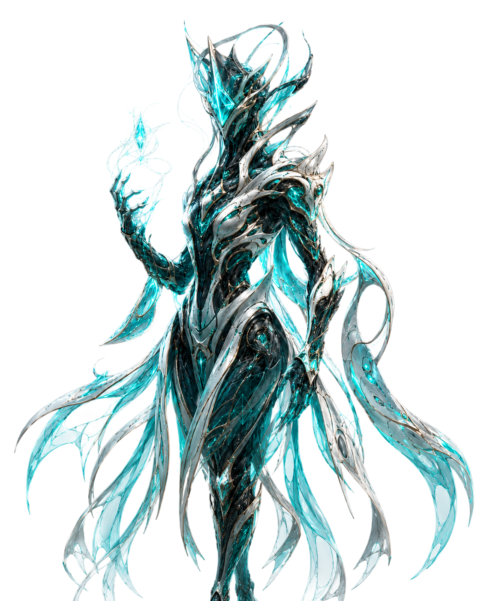

# OMNI — Multi-Agent AI Robotics Builder\n\nOMNI is a multi-agent AI robotics engineering system designed to speed up personal mechatronics, robotics, CAD, and ROS2 project development.\n\nInstead of only returning a text response, OMNI acts like an early-stage engineering command center. It takes a rough natural-language idea, expands it into a structured mission, coordinates specialized AI agents, generates project files, validates build outputs, and exports artifacts that can be reviewed, tested, and improved.\n\nThe purpose of OMNI is to help move personal engineering projects from idea to prototype faster.\n\n---\n\n## Why OMNI Matters\n\nPersonal mechatronics projects are difficult because they combine several engineering disciplines at once:\n\n- Software development\n- ROS2 robotics architecture\n- Mechanical design\n- CAD modeling\n- Electronics planning\n- Simulation\n- Testing and validation\n- Documentation\n\nA simple idea like “build a rover,” “design a drone,” or “make a robotic desk assistant” quickly becomes a large system with many moving parts.\n\nOMNI was created to reduce that early-stage friction.\n\nThe goal is not to replace engineering judgment. The goal is to give the builder a strong starting point: a structured project plan, generated ROS2 package files, CAD concept logic, validation reports, test checklists, and reviewable artifacts.\n\nThis makes OMNI useful for students, hobbyists, and early-stage engineers who want to build mechatronics projects faster without starting every subsystem from scratch.\n\nOMNI is designed to preserve engineering context, not just generate outputs. Each exported mission now includes a mission report and provenance record so users can review what was generated, what assumptions were made, what still needs validation, and which artifacts require human approval before hardware use!\n\n---\n\n## Project Vision\n\nOMNI is being developed as a personal AI-assisted mechatronics lab.\n\nThe long-term vision is to let a user describe a robotics or hardware idea in natural language and receive a complete engineering starting package. That package can include:\n\n- ROS2 nodes and topic contracts\n- Launch files and configuration files\n- CAD concept scripts\n- Fusion 360 design logic\n- Simulation planning\n- Validation steps\n- Safety notes\n- Artifact manifests\n- Build reports\n- Documentation\n\nThe project explores one central question:\n\n> How can AI agents help individuals design, validate, and iterate on complex robotics and mechatronics projects faster?\n\nFor personal robotics development, this matters because the hardest part is often not just writing code or drawing CAD. The hard part is connecting everything into a complete workflow: requirements, design, software, simulation, validation, and iteration.\n\nOMNI is meant to create momentum by turning a rough idea into a structured engineering foundation.\n\n---\n\n## Current Status\n\nOMNI currently supports:\n\n- Natural-language mission input\n- Echo quick-idea interpretation\n- Multi-agent mission synthesis\n- ROS2 Python package generation\n- ROS2 node, topic, launch, config, docs, and test script export\n- Automatic `colcon build` validation\n- ROS2 launch/topic smoke testing\n- Build report generation\n- Fusion 360 Python script generation\n- CAD pattern context for rover, drone, enclosure, and robotics concepts\n- React frontend for mission control and artifact viewing\n- FastAPI backend for mission execution and export workflows\n- ROS2 simulation status monitoring from the dashboard\n- CAD artifact pipeline for generated engineering outputs\n- Automatic Mission Report Exports: OMNI now generates structured mission dossiers containing mission summaries, generated artifacts, validation results, engineering provenance, exported file manifests, and human approval gates.\n\n---\n\n## OMNI Agent Council\n\nOMNI is powered by a team of specialized AI agents. Each character represents a different engineering role inside the system. Together, they form a coordinated workflow for turning rough ideas into structured robotics, CAD, ROS2, simulation, and validation artifacts.\n\n
\n  \n  \n  \n  \n  \n  \n  \n  \n  \n
\n\n### Agent Roles\n\n| Agent | Role | Importance |\n|---|---|---|\n| **OMNI** | Mission Orchestrator / Systems Intelligence | Defines mission strategy, connects specialist outputs, and produces the revised final blueprint. |\n| **Echo** | Mission Interpreter / Prompt Expansion Agent | Transforms rough human ideas into structured OMNI missions before the specialist agents begin. |\n| **Vega** | Creative Design Expansion / Morphology Exploration | Generates unconventional but physically plausible design alternatives. |\n| **Sky** | Robotics, ROS2, Drones, and Autonomy | Generates software architecture, ROS2 nodes, topics, launch plans, and simulation workflow. |\n| **Korva** | Hardware, Electronics, Embedded Systems, and PCB | Generates hardware architecture, wiring logic, electronics constraints, power assumptions, and PCB direction. |\n| **Isy** | Physics, Controls, Dynamics, and Feasibility | Checks physical feasibility, control logic, dynamics, torque, mass, stability, and sensor-fusion concerns. |\n| **Oli** | CAD, Fusion 360, 3D Concepts, and Visual Artifacts | Generates CAD-ready concepts, Fusion 360 modeling steps, component layout, and visual artifact plans. |\n| **Pluto** | Risk, Failure Analysis, and Safety Gates | Finds dangerous assumptions, failure modes, unsafe tests, missing requirements, and stop conditions. |\n| **QaZ** | Validation, Scoring, and Requirements Verification | Scores mission output, identifies missing evidence, and recommends next validation tests. |\n\n---\n