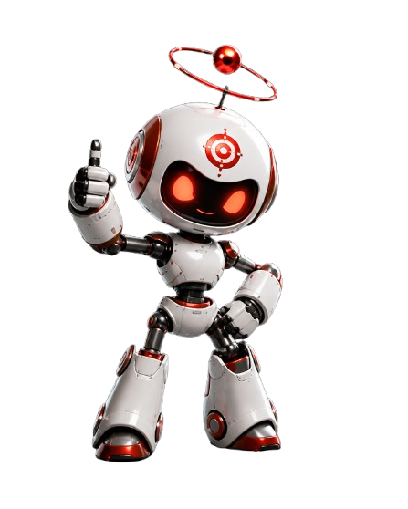
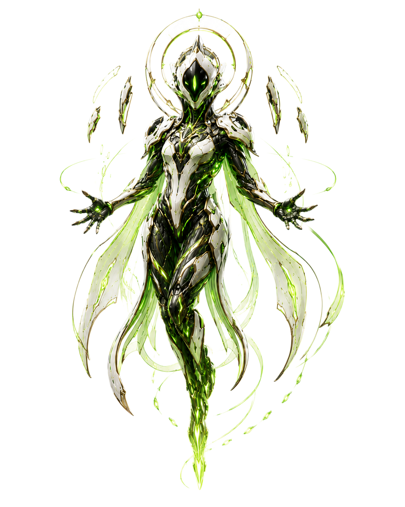
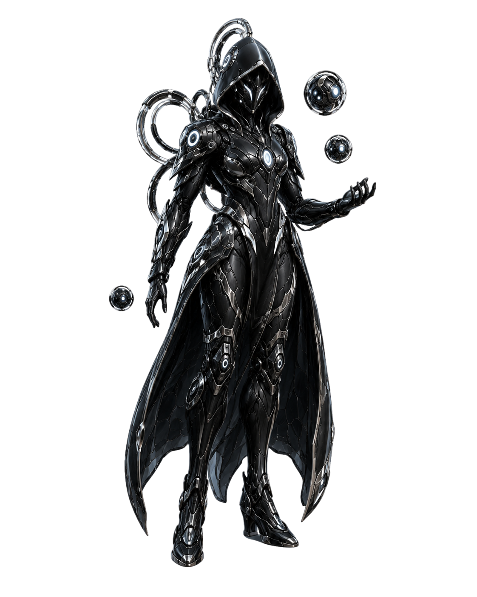
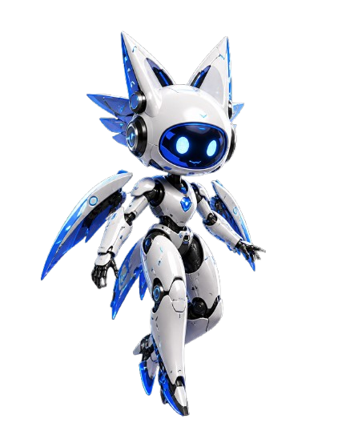
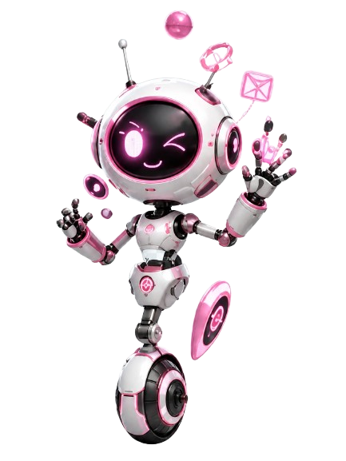
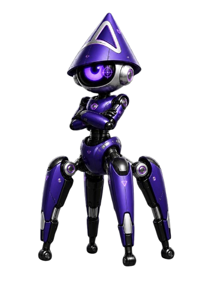
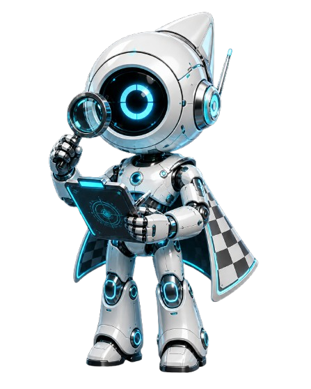
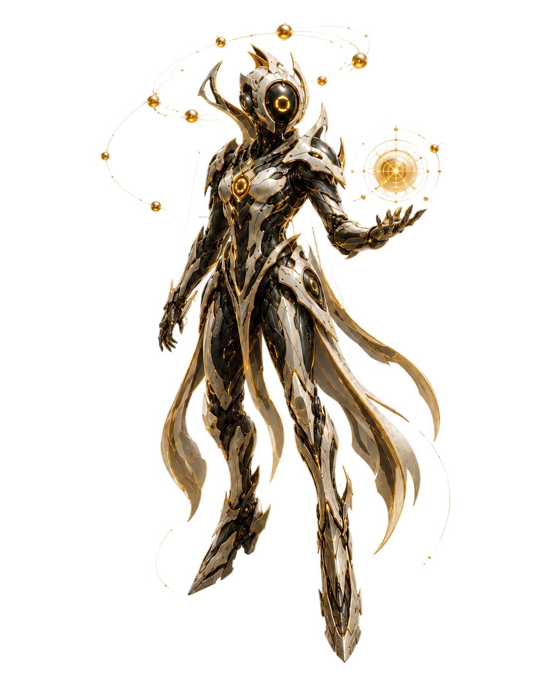

# OMNI — Multi-Agent AI Robotics Builder

OMNI is a multi-agent AI robotics engineering system designed to speed up personal mechatronics, robotics, CAD, and ROS2 project development.

Instead of only returning a text response, OMNI acts like an early-stage engineering command center. It takes a rough natural-language idea, expands it into a structured mission, coordinates specialized AI agents, generates project files, validates build outputs, and exports artifacts that can be reviewed, tested, and improved.

The purpose of OMNI is to help move personal engineering projects from idea to prototype faster.

---

## Why OMNI Matters

Personal mechatronics projects are difficult because they combine several engineering disciplines at once:

- Software development
- ROS2 robotics architecture
- Mechanical design
- CAD modeling
- Electronics planning
- Simulation
- Testing and validation
- Documentation

A simple idea like “build a rover,” “design a drone,” or “make a robotic desk assistant” quickly becomes a large system with many moving parts.

OMNI was created to reduce that early-stage friction.

The goal is not to replace engineering judgment. The goal is to give the builder a strong starting point: a structured project plan, generated ROS2 package files, CAD concept logic, validation reports, test checklists, and reviewable artifacts.

This makes OMNI useful for students, hobbyists, and early-stage engineers who want to build mechatronics projects faster without starting every subsystem from scratch.

---

## Project Vision

OMNI is being developed as a personal AI-assisted mechatronics lab.

The long-term vision is to let a user describe a robotics or hardware idea in natural language and receive a complete engineering starting package. That package can include:

- ROS2 nodes and topic contracts
- Launch files and configuration files
- CAD concept scripts
- Fusion 360 design logic
- Simulation planning
- Validation steps
- Safety notes
- Artifact manifests
- Build reports
- Documentation

The project explores one central question:

> How can AI agents help individuals design, validate, and iterate on complex robotics and mechatronics projects faster?

For personal robotics development, this matters because the hardest part is often not just writing code or drawing CAD. The hard part is connecting everything into a complete workflow: requirements, design, software, simulation, validation, and iteration.

OMNI is meant to create momentum by turning a rough idea into a structured engineering foundation.

---

## Current Status

OMNI currently supports:

- Natural-language mission input
- Echo quick-idea interpretation
- Multi-agent mission synthesis
- ROS2 Python package generation
- ROS2 node, topic, launch, config, docs, and test script export
- Automatic `colcon build` validation
- ROS2 launch/topic smoke testing
- Build report generation
- Fusion 360 Python script generation
- CAD pattern context for rover, drone, enclosure, and robotics concepts
- React frontend for mission control and artifact viewing
- FastAPI backend for mission execution and export workflows
- ROS2 simulation status monitoring from the dashboard
- CAD artifact pipeline for generated engineering outputs

---

## AI Avengers Agent Team

OMNI is powered by a team of specialized AI agents. Each character represents a different engineering role inside the system. Together, they form a coordinated workflow for turning rough ideas into structured robotics, CAD, ROS2, simulation, and validation artifacts.

  
  
  
  
  
  
  
  

### Agent Roles

| Agent | Role | Importance |
|---|---|---|
| **OMNI** | Central Command System | Connects the frontend, backend, agent workflow, artifact generation, and validation process into one robotics builder. |
| **Echo** | Mission Interpreter | Turns rough ideas into clearer engineering missions before the specialist agents begin. |
| **Korva** | Robotics Systems Specialist | Focuses on robot structure, sensors, actuators, ROS2 nodes, topics, launch planning, and simulation readiness. |
| **Sky** | Drone and Autonomous Systems Specialist | Supports drone missions, aerial robotics constraints, payload planning, stability concerns, and autonomous vehicle workflows. |
| **Qaz** | CAD and Forge Artifact Specialist | Helps convert requirements into CAD parameters, Fusion 360 concepts, CadQuery-style scripts, STEP/STL export plans, and design artifacts. |
| **Pluto** | Validation and Safety Reviewer | Reviews weak assumptions, missing requirements, unsafe design choices, and incomplete testing plans. |
| **Oli** | Code and Implementation Specialist | Generates practical project files such as ROS2 Python nodes, launch files, backend routes, frontend logic, configs, and tests. |
| **Isy** | Research and Documentation Specialist | Expands mission context, organizes requirements, explains design decisions, and improves documentation quality. |

---