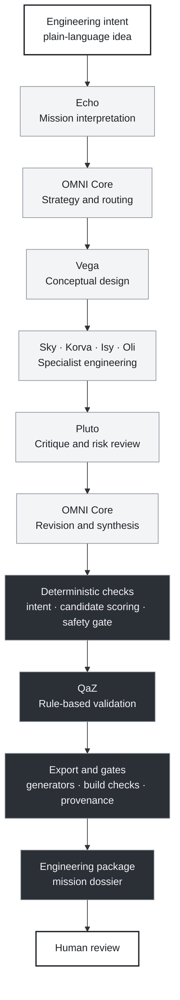
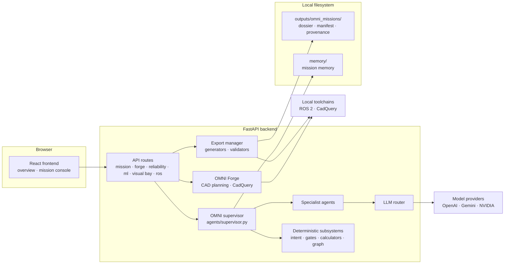

<p align="center">
  
</p>

<h1 align="center">OMNI</h1>

<p align="center"><strong>Orchestrated Multi-AI Networked Intelligence</strong></p>

<p align="center">
  An experimental AI-native engineering system that turns a rough idea<br />
  into a structured, reviewable engineering package.
</p>

<p align="center">
  <a href=".github/workflows/omni-ci.yml"></a>
  
  
  
  
  
</p>

<p align="center">
  <a href="#what-is-omni">About</a> ·
  <a href="#how-a-mission-moves-through-omni">Pipeline</a> ·
  <a href="#capabilities">Capabilities</a> ·
  <a href="#agents">Agents</a> ·
  <a href="#engineering-systems">Systems</a> ·
  <a href="#architecture">Architecture</a> ·
  <a href="#current-status">Status</a> ·
  <a href="#explore-omni-without-installing">Explore</a> ·
  <a href="#running-omni-locally">Run locally</a>
</p>

OMNI coordinates specialist AI agents with deterministic engineering code and real toolchains: ROS 2, CadQuery, Fusion 360, and KiCad. A mission enters as plain language and leaves as a mission dossier. The dossier holds design reasoning, generated project files, validation results, and a record of how each result was produced.

Everything a model generates is treated as a candidate engineering artifact. OMNI checks it, labels it, and hands it to a person for review.

> [!NOTE]
> OMNI is experimental research software under active development. Interfaces, outputs, and file formats will change. It does not certify designs, and it does not act on the physical world.

<!--
  MEDIA SLOT: hero
  Mission console screenshot, e.g. docs/screenshots/mission-console.png
  <p align="center"></p>
-->

---

## What is OMNI?

Hardware projects cross many disciplines at once: software, robotics, mechanical design, electronics, physics, and testing. A single language model can discuss all of them. But it can't reliably check its own work, and its answers leave no trail.

OMNI is an experiment in giving that work structure. It splits an engineering problem among specialist agents with narrow responsibilities and requires structured output from them. Deterministic code then works on the results. It extracts intent, scores candidates, runs gates and calculations, generates files, and checks builds.

The system depends on keeping two kinds of work separate:

|  | Generative reasoning | Deterministic tooling |
| --- | --- | --- |
| **Run by** | Language models behind OMNI Core and eight specialist agents | Plain, tested Python with no model in the loop |
| **Produces** | Mission briefs, design alternatives, specialist reports, critique, a revised blueprint | Structured intent, candidate scores, gate reports, calculations, generated project files, build results, manifests |
| **Role** | Proposes | Checks, records, and packages |
| **Treated as** | A candidate, never as truth | Evidence about a candidate: advisory, not certification |

**What OMNI is not**

- **Not a fully autonomous engineer.** A person reviews the results and makes the decisions that matter.
- **Not a certified engineering tool.** Its gates are advisory aids.
- **Not an autonomous fabrication system.** It writes files. It does not run printers, tools, or robots.
- **Not a finished product.** It is a research codebase, and its parts are at different stages of maturity, as labeled on this page.

## How a mission moves through OMNI

Every mission follows the same ordered pipeline. The pipeline is implemented in [`agents/supervisor.py`](agents/supervisor.py), and the dossier is written by [`backend/app/export/export_manager.py`](backend/app/export/export_manager.py).



<sub>Light nodes are model-generated. Graphite nodes are deterministic code. QaZ is an agent, but its validation is rule-based, not model-generated.</sub>

| Stage | What happens | Output |
| --- | --- | --- |
| **Interpret** | Echo expands a rough idea into a full mission brief. A mission that is already fully specified can skip this stage. | Expanded mission, detected domains, assumptions, missing inputs, safety notes |
| **Strategize** | OMNI Core sets objectives, build phases, human approval gates, and specialist assignments. | Mission strategy |
| **Design** | Vega explores design alternatives. Sky, Korva, Isy, and Oli each return strict JSON against their own schema, either one after another or concurrently. | Design alternatives, plus robotics, electronics, physics, and CAD reports |
| **Critique** | Pluto reviews the drafts for unsafe assumptions, failure modes, and missing requirements. The critique is then converted into structured form. | Risk level, required fixes, stop conditions |
| **Revise** | OMNI Core rewrites the blueprint so that it acts on the critique instead of just summarizing it. | Revised final blueprint |
| **Check** | Deterministic code compiles mission intent, scores Vega's candidates, and runs the advisory Pluto safety gate and a readiness gate. | Intent, candidate evaluation, safety gate, and readiness reports |
| **Validate** | QaZ runs rule-based checks covering systems, physics, mechanical, electrical, controls, robotics dynamics, and planning. | Score out of 10, verdict, missing evidence, next tests |
| **Export** | The export manager writes the dossier and runs whichever generators and gates the mission calls for. | Mission dossier with artifact manifest and provenance record |

When an agent fails, OMNI records the failure, substitutes a clearly marked fallback, and keeps going. The gap stays visible in the mission state.

## Capabilities

| Label | Meaning |
| --- | --- |
| `AVAILABLE` | Implemented and exercised by missions today |
| `EARLY` | A working foundation with deliberately limited scope |
| `EXPERIMENTAL` | Functional, demonstration-grade |
| `RESEARCH` | Exploratory engineering-process work outside the mission pipeline |

| Capability | Current function | Maturity |
| --- | --- | --- |
| **Mission interpretation** | Echo turns a rough idea into a mission brief with domains, assumptions, missing inputs, and safety notes. A deterministic compiler extracts structured intent, such as the platform type and mobility requirements. | `AVAILABLE` |
| **Engineering design** | Vega proposes design alternatives. A deterministic evaluator scores each candidate from six specialist perspectives and recommends one. | `AVAILABLE` |
| **Robotics / ROS 2** | Generates a ROS 2 Python package with nodes, launch and config files, and a URDF/Xacro description. When ROS 2 Humble is installed, it then checks expected files, `colcon build`, installed files, a smoke script, and a launch check. | `AVAILABLE` |
| **CAD / geometry** | OMNI Forge turns a simple workshop-part request into a validated parameter plan, a CadQuery script, and STEP/STL exports. Supported parts are mounts, brackets, enclosures, holders, and clips. Missions with CAD content also get a Fusion 360 concept script and a morphology gate report. | `EARLY` |
| **Electronics / hardware** | Korva plans components, wiring, power, and communication buses. The export generates a starter KiCad project (architecture, power budget, connector map, BOM), which a KiCad knowledge gate checks. Its schematic and PCB files are placeholders, not a designed board. | `EARLY` |
| **Physics / feasibility** | Isy reviews dynamics, controls, mass, stability, and power–motion relationships. When the required inputs exist, deterministic calculators estimate battery runtime, power budget, and thrust-to-weight. | `AVAILABLE` |
| **Validation / critique** | Covers Pluto's critique, the advisory Pluto safety gate, QaZ's rule-based validation, and the mission graph and morphology gates. | `AVAILABLE` |
| **Reliability** | An on-demand review that reports `PASS` / `WARN` / `FAIL` / `BLOCKED` gates for requirements, artifact presence, ROS 2 build results, visual evidence, and calculations. It includes a provenance record and is tested against golden-standard rover and drone cases. | `EARLY` |
| **Simulation** | Sky writes a simulation plan. A read-only status service lists ROS 2 nodes and topics and detects Gazebo, RViz, and Foxglove. Visual Bay catalogs URDF, world, and RViz assets. Nothing is launched. | `EARLY` |
| **Machine learning / OMNITorch** | A stable inference API around registered PyTorch models. It currently serves a Fashion-MNIST demonstration classifier and a heuristic image review for CAD screenshots. It does not understand CAD geometry. | `EXPERIMENTAL` |
| **Visual Bay** | Scans an export for CAD, ROS 2, and simulation assets and writes an abstract glTF scene for preview in the browser. The scene is placeholder geometry, not an accurate CAD model. | `EARLY` |
| **TestCube** | Validates two candidate code patches with trusted commands inside Linux namespace isolation, then compares them with a deterministic arbiter. The winner is only a candidate for human review. | `RESEARCH` |
| **Super-Build** | Persistent, hash-linked project workspaces. An accepted TestCube result advances a project-local commit, but only after a typed human confirmation. No model providers are connected. | `RESEARCH` |

## Example mission

The repository ships two benchmark prompts in [`examples/golden_standards/`](examples/golden_standards/). The rover benchmark below is abridged.

> **Intent**
>
> Design a small autonomous ground rover for indoor robotics experimentation. Include a ROS 2 node architecture, differential-drive mechanical layout, motor torque estimate, battery runtime estimate, sensor layout plan, KiCad electronics planning artifact, URDF or simulation plan, CAD concept script, validation report, and provenance record. Clearly separate verified calculations, assumptions, missing information, and safety limitations.

Here is what each stage contributes, shown conceptually:

```text
Echo        →  expanded mission brief · detected domains · assumptions
               missing inputs to confirm · safety notes
OMNI Core   →  objectives · build phases · human approval gates
Vega        →  alternative rover layouts, scored by the candidate evaluator
Sky         →  ROS 2 package plan: nodes, topics, launch and config files
Korva       →  components · wiring plan · power assumptions · buses
Isy         →  stability, torque, and power–motion notes · known unknowns
Oli         →  CAD direction · Fusion 360 modeling steps · component layout
Pluto       →  risk level · required fixes · stop conditions
OMNI Core   →  revised blueprint that acts on Pluto's critique
Checks      →  mission intent · candidate evaluation · Pluto safety gate
QaZ         →  score out of 10 · verdict · missing evidence · next tests
Export      →  mission dossier (below)
Human       →  decides what, if anything, gets built
```

The export is a local folder:

```text
outputs/omni_missions/<mission-slug>/
├── README.md                           export summary
├── OMNI_MISSION_REPORT.md              consolidated mission report
├── mission_report.md · final_blueprint.md
├── critique.json · revision.json · validation.json
├── mission_graph.json · mission_graph_review.json
├── mission_intent_report.json · candidate_evaluation_report.json
├── pluto_safety_gate_report.json · design_understanding_report.json
├── engineering_calculation_report.json and input-readiness reports
├── visual_bay_manifest.json · concept_dossier_manifest.json
├── artifact_manifest.json · provenance_record.json
├── agent_reports/                      one Markdown report per agent
├── artifacts/                          ROS 2 plan, component tree, hardware architecture,
│                                       risk matrix, test checklist, approval gates, gate reports
├── generated_ros2/<package>/           ROS 2 Python package and build validation reports
├── generated_fusion360/                Fusion 360 concept script
├── generated_kicad/                    starter KiCad project, BOM, power budget, knowledge gate
└── generated_visual_bay/               abstract glTF preview scene
```

Generators run only when a mission calls for them. A ROS 2 package needs a ROS 2 plan, a KiCad project needs electronics content, calculations need numeric inputs, and build checks need a local ROS 2 Humble install. Exports are git-ignored, so the repository doesn't include an example dossier yet.

> Visual mission walkthrough coming soon.

<!--
  MEDIA SLOT: example mission
  1. Recorded run of this benchmark (GIF or linked video)
  2. Dossier folder view
  3. Generated ROS 2 package and colcon build result
  4. KiCad project opened in KiCad
  5. QaZ validation and Pluto safety gate reports in the console
  Store assets under docs/screenshots/ and reference them here.
-->

## Agents

Each agent owns one part of the problem. Specialists return structured output that matches a defined schema, so later stages can check the output instead of just displaying it.

| Agent | Responsibility |
| --- | --- |
| **Echo** | Mission interpretation. Expands a rough idea into a mission brief and names the inputs a person must confirm. |
| **Vega** | Conceptual design. Explores distinct, physically plausible design alternatives and morphologies. |
| **Sky** | Robotics and autonomy. Plans the ROS 2 architecture: nodes, topics, launch plans, sensor stack, and simulation plan. |
| **Korva** | Electronics and hardware. Covers components, wiring, power assumptions, communication buses, and PCB direction. |
| **Isy** | Physics and feasibility. Covers dynamics, controls, mass and geometry assumptions, stability, and known unknowns. |
| **Oli** | CAD and geometry. Covers CAD direction, Fusion 360 modeling steps, component layout, and fabrication notes. |
| **Pluto** | Critique and risk review. Flags unsafe assumptions, failure modes, missing requirements, and stop conditions. |
| **QaZ** | Validation. Gives the revised output a rule-based score and lists missing evidence and recommended next tests. |

**OMNI Core** is the orchestrator, not a specialist. It sets mission strategy and approval gates and routes context between agents. It also turns Pluto's critique into required fixes and writes the revised final blueprint.

Agents call models through one router, [`backend/app/omni_core/llm_router.py`](backend/app/omni_core/llm_router.py). By default Vega uses Gemini and the other model-backed agents use OpenAI. An NVIDIA endpoint can also be configured.

## Engineering systems

Most of OMNI's code sits outside the agent layer. It is deterministic engineering and process tooling.

**Mission and engineering systems**

| System | Purpose | Maturity |
| --- | --- | --- |
| **OMNI Forge** | Takes a prompt through a validated workshop-part spec, CAD parameter plan, and CadQuery script to STEP/STL export, and screens the script before running it. | `EARLY` |
| **Reliability Core** | Produces evidence-backed gates, deterministic rover, drone, and power calculators, provenance records, and golden-standard cases. | `EARLY` |
| **Mission Knowledge Graph** | Builds a typed graph from each export and reviews it deterministically for consistency. | `AVAILABLE` |
| **Engineering Brain** | Combines a knowledge registry, an input-readiness report, and a concept-stage calculation engine. | `EARLY` |
| **Visual Bay** | Builds an asset manifest and an abstract glTF preview for the browser viewer. It never runs scripts or launches simulators. | `EARLY` |
| **Concept Dossier** | Assembles a concept-stage presentation manifest from the export. | `EARLY` |
| **AeroForge** | Detects aerospace intent and applies a concept-stage entry gate. It makes no airworthiness claims. | `EARLY` |
| **OMNITorch** | A model-agnostic PyTorch inference API, currently serving a demonstration classifier. | `EXPERIMENTAL` |
| **Simulation infrastructure** | Provides simulation planning, read-only ROS 2 status, and simulation-asset detection. A dedicated Simulation Core does not exist yet. | `EARLY` |
| **OMNI Sandbox** | A standalone deterministic check and command-execution harness. It is not a security sandbox and is not wired into the mission runtime. | `EARLY` |

**Engineering-process systems.** These govern how OMNI's own software changes.

| System | Purpose | Maturity |
| --- | --- | --- |
| **TestCube** | Evaluates competing code patches in isolation and arbitrates between them deterministically. *AI proposes. Deterministic code disposes.* | `RESEARCH` |
| **Super-Build** | Persistent, human-gated project workspaces with hash-linked history, built on TestCube evidence. | `RESEARCH` |
| **Frontier Research Lab** | Archived hypothesis-and-experiment exchanges between Claude and Codex, including negative results. | `RESEARCH` |
| **Auto Dev** | Non-autonomous production tooling: task and review packet contracts, an issue readiness check, and protected-path matching. | `EARLY` |

## Architecture

OMNI is a local-first modular monolith. It has one FastAPI backend, one React frontend, and one in-process supervisor. It has no message queue, service mesh, or distributed workers. Mission results go to the local filesystem, and the mission runtime doesn't need a database.



| Layer | Location |
| --- | --- |
| Frontend | `frontend/src/`: public overview (`site/`) and mission console (`App.jsx`, `components/`) |
| API | `backend/app/main.py`, `backend/app/api/` |
| Supervisor and agents | `agents/` |
| Mission runtime core | `backend/app/omni_core/`: mission state, intent, LLM router, safety gate, telemetry |
| Deterministic subsystems | `backend/app/`: `mission_graph/`, `reliability/`, `engineering/`, `cad/`, `generators/`, `validators/`, `visual_bay/`, `aeroforge/`, `concept_dossier/`, `cortex/`, `sandbox/` |
| Export | `backend/app/export/export_manager.py` |
| Memory and telemetry | `memory/`, `logs/telemetry/` |
| Command-line runners | `omni_harness.py` (run a mission from a terminal), `omni_graph.py`, `omni_indexer.py` |
| Engineering-process tooling | `omni/`: Auto Dev, TestCube, Super-Build, Frontier |

**Provenance** takes more than one form today. The reliability review, the mission graph, the command-line harness, and the export path each keep their own record. These records aren't interchangeable yet, and the repository documents them as separate shapes.

For more depth, read the [repository map](docs/agentic/repository_map.md), the [sandbox contract](docs/contracts/sandbox.md), and the [findings projection contract](docs/contracts/findings_projection.md).

## Engineering philosophy

**Generate boldly.** Models are used where they are strong: interpreting intent, proposing alternatives, and reasoning across disciplines.

**Verify aggressively.** Something other than a model checks every model output: schemas, gates, calculators, build checks, and rule-based validation.

**Expose assumptions.** Agents must state assumptions, missing inputs, known unknowns, and stop conditions. Calculations run only when their inputs actually exist.

**Preserve provenance.** Each export records what was generated, which stage produced it, and what still lacks evidence.

**Keep physical authority human-controlled.** OMNI may generate, validate, and prepare files. It may not start fabrication, heat tools, move robots, or control workshop hardware without explicit human approval.

A generated output is a candidate engineering artifact. Its standing comes from the checks it has passed, not from how confident it sounds. The guiding rule is [accountability before autonomy](docs/OMNI_FORGE_ROADMAP.md#accountability-before-autonomy).

## Current status

### In place today

- The full pipeline from Echo through OMNI Core, the specialists, critique, and revision to QaZ, with structured outputs and visible fallbacks
- Deterministic mission intent, candidate evaluation, Pluto safety gate, and readiness gate
- Mission dossiers with an artifact manifest and provenance record
- ROS 2 package generation with `colcon build`, smoke, and launch checks (requires a ROS 2 Humble install)
- OMNI Forge CadQuery execution with STEP/STL export for simple workshop parts
- Starter KiCad projects with a knowledge gate, and Fusion 360 concept scripts
- An on-demand reliability review tested against golden-standard cases
- A curated pytest suite, with GitHub Actions CI for the backend tests and the frontend build

### Current development

Recent work focuses on letting OMNI's own software change only under evidence and human control.

- **TestCube:** supervised generation of two candidate patches, isolated evidence collection, and deterministic arbitration. Live model-provider trials run only on explicit human instruction. The trials documented so far failed at the generation step, which led to the current structured-edit transport.
- **Super-Build Box v0:** persistent, human-gated project workspaces. Independent review is still outstanding.
- **Frontier Research Lab:** structured, archived research exchanges between Claude and Codex.

### Longer-term research

These are goals, not current capabilities.

- A dedicated **Simulation Core** that goes beyond simulation planning, status monitoring, and asset detection
- Broader **design-space exploration** and candidate evaluation
- **Fabrication preparation:** slicer profile recommendations, print orientation notes, filament estimates, and G-code preparation plans
- **Deeper CAD and electronics workflows** that go beyond concept scripts and starter KiCad placeholders
- **OMNITorch** models trained on CAD morphology, for visual validation of generated designs
- **Larger-scale software evolution:** Super-Build beyond small bug fixes, with a separately reviewed, human-controlled promotion path
- **Workshop integration** (Home Assistant, MQTT, OctoPrint, printer cameras, emergency-stop logic), with human approval required for every physical action

See the [OMNI Forge Roadmap](docs/OMNI_FORGE_ROADMAP.md).

## Explore OMNI without installing

**Design and source**

| Topic | Start here |
| --- | --- |
| Architecture map | [`docs/agentic/repository_map.md`](docs/agentic/repository_map.md) |
| Roadmap and safety rule | [`docs/OMNI_FORGE_ROADMAP.md`](docs/OMNI_FORGE_ROADMAP.md) |
| Mission pipeline | [`agents/supervisor.py`](agents/supervisor.py) |
| Agents | [`agents/`](agents/) · roster in [`frontend/src/content/agents.js`](frontend/src/content/agents.js) |
| Dossier contents | [`backend/app/export/export_manager.py`](backend/app/export/export_manager.py) |
| Repository rules | [`docs/agentic/repository_invariants.md`](docs/agentic/repository_invariants.md) |
| Documentation index | [`docs/README.md`](docs/README.md) |

**Subsystem documentation**

| System | Document |
| --- | --- |
| OMNITorch | [`backend/app/ml/README.md`](backend/app/ml/README.md) |
| OMNI Sandbox | [`docs/contracts/sandbox.md`](docs/contracts/sandbox.md) |
| Findings projection | [`docs/contracts/findings_projection.md`](docs/contracts/findings_projection.md) |
| TestCube arbiter | [`docs/agentic/testcube_arbiter.md`](docs/agentic/testcube_arbiter.md) |
| TestCube collector | [`docs/agentic/testcube_collector.md`](docs/agentic/testcube_collector.md) |
| TestCube candidate generation | [`docs/agentic/testcube_candidate_harness.md`](docs/agentic/testcube_candidate_harness.md) |
| Super-Build Box v0 | [`docs/agentic/superbuild_box_v0.md`](docs/agentic/superbuild_box_v0.md) |
| Frontier Research Lab | [`.omni-lab/README.md`](.omni-lab/README.md) · [first archived experiment](.omni-lab/experiments/OMNI-FRONTIER-0001/conclusion.md) |
| Agentic production protocol | [`docs/agentic/production_protocol.md`](docs/agentic/production_protocol.md) |
| Auto Dev | [`docs/devops/omni_autodev.md`](docs/devops/omni_autodev.md) |
| CI | [`docs/devops/omni_ci.md`](docs/devops/omni_ci.md) |

**Examples**

| Example | Location |
| --- | --- |
| Benchmark mission: autonomous rover | [`examples/golden_standards/gs2_autonomous_rover/prompt.txt`](examples/golden_standards/gs2_autonomous_rover/prompt.txt) |
| Benchmark mission: quadcopter | [`examples/golden_standards/gs1_quadcopter/prompt.txt`](examples/golden_standards/gs1_quadcopter/prompt.txt) |
| Reference ROS 2 package | [`knowledge/ros2_examples/omni_rover/`](knowledge/ros2_examples/omni_rover/) |

**Media**

| Resource | Status |
| --- | --- |
| Public web demo | Coming soon |
| Screenshots | Coming soon |
| Recorded mission walkthrough | Coming soon |
| Example generated dossier | Coming soon |

<!-- MEDIA SLOTS: replace "Coming soon" with links as each asset is published. Screenshots belong in docs/screenshots/. -->

## Repository map

```text
agents/            Supervisor and agent implementations
backend/app/       FastAPI application and deterministic engineering subsystems
frontend/          React + Vite public overview and mission console
omni/              Engineering-process tooling: Auto Dev, TestCube, Super-Build, Frontier
docs/              Architecture map, contracts, agentic workflow, roadmap, CI
examples/          Golden-standard benchmark prompts
knowledge/         ROS 2 patterns, a reference ROS 2 package, morphology knowledge
memory/            Local mission memory manager
scripts/           Local CI, TestCube and Frontier CLIs, Auto Dev, dev launcher
tests/             Curated pytest suite (the enforced test scope)
.omni-lab/         Frontier research protocols and archived experiments
omni_harness.py    Command-line mission runner
outputs/           Generated mission dossiers (git-ignored)
```

## Running OMNI locally

You don't need to run OMNI to understand it. If you want to run it, start here.

### Prerequisites

- Python 3.10
- Node.js 20
- API keys for the default model routing: `OPENAI_API_KEY` and `GEMINI_API_KEY` (read by `agents/llm_clients.py`)
- PyTorch and torchvision. The OMNITorch routes import them when the backend starts, and `requirements.txt` does not pin them.

Optional, per subsystem:

- **ROS 2 Humble** for ROS 2 build validation and live ROS status
- **CadQuery** (listed in `requirements.txt`) for OMNI Forge CAD execution
- **Bubblewrap** and Linux user namespaces for TestCube and Super-Build isolated evaluation

### Backend

```bash
git clone https://github.com/Honrrii/OMNI.git
cd OMNI

python3.10 -m venv .venv
source .venv/bin/activate
pip install -r requirements.txt
pip install torch torchvision   # pick the build that matches your platform
```

`requirements.txt` captures a full development machine. That includes ROS 2 Humble Python packages, which come from a ROS 2 installation rather than PyPI. On a machine without ROS 2, those entries won't install. CI installs a smaller dependency set for the test suite; see [`.github/workflows/omni-ci.yml`](.github/workflows/omni-ci.yml).

Create a `.env` file in the repository root. It is git-ignored.

```bash
OPENAI_API_KEY=your-key
GEMINI_API_KEY=your-key
# Optional NVIDIA route: NVIDIA_API_KEY, NVIDIA_BASE_URL, NVIDIA_MODEL
```

Start the API:

```bash
uvicorn backend.app.main:app --reload --host 127.0.0.1 --port 8000
```

Interactive API documentation is served at `http://127.0.0.1:8000/docs`.

### Frontend

```bash
cd frontend
npm install
npm run dev
```

Open `http://localhost:5173` for the overview. The mission console is at `http://localhost:5173/#/console` and expects the backend at `http://127.0.0.1:8000`.

`scripts/start_omni_dev.sh` starts both services together. It assumes the repository is at `~/AI_Avengers_HQ` with a virtual environment named `avengers_env`.

### Command line

```bash
python omni_harness.py --dry-run "Design a small indoor rover with ROS 2"   # placeholder files, no model calls
python omni_harness.py "Design a small indoor rover with ROS 2"
```

Add `--parallel` to run the four specialists concurrently. When run this way, the specialists don't see each other's outputs.

### Tests

```bash
PYTEST_DISABLE_PLUGIN_AUTOLOAD=1 python -m pytest tests -q
python scripts/omni_ci_local.py   # whitespace check, test suite, and frontend build
```

The environment variable stops globally installed pytest plugins, such as ROS 2's, from breaking collection. Some TestCube and Super-Build tests use real Linux namespace isolation, so they need Bubblewrap with permission to create namespaces. See the [test matrix](docs/agentic/test_matrix.md) for scoped runs.

## Responsible use

- OMNI produces engineering starting points and experimental artifacts. They are not finished or certified designs.
- A qualified person must review every output (code, CAD, electronics plans, calculations, and gate results) before it informs any hardware work.
- The Pluto safety gate and the reliability gates are deterministic, advisory aids. They do not certify safety.
- OMNI does not control fabrication equipment, robots, or workshop hardware. Every physical action requires explicit human authority.
- Model-backed stages send mission text to third-party model providers. Don't submit information you aren't permitted to share.

## Project status and contributing

OMNI is experimental and under active development. Expect interfaces, output formats, and maturity labels to change as subsystems harden.

There is no contribution guide yet. Changes in this repository follow the [agentic production protocol](docs/agentic/production_protocol.md) and [repository invariants](docs/agentic/repository_invariants.md): bounded task packets, a separate reviewer, and evidence taken from real command output.

The repository does not include a license file yet.

---

<p align="center">
  <br />
  <sub>No mission dies as output. Every mission becomes provenance.</sub>
</p>
